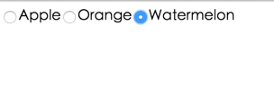

# uxcore-radiogroup
---

uxcore-radiogroup ui component for react




```sh
$ git clone https://github.com/uxcore/uxcore-radiogroup
$ cd uxcore-radiogroup
$ npm install
$ npm run dev
```

then nav http://localhost:9090/example/ to see the demo


## Apply scope

* radiogroup

	```
	var RadioGroup = require('../lib/index.jsx');
	var App=
		<RadioGroup name="fruit" value="orange">
		  <input type="radio" value="apple" />Apple
		  <input type="radio" value="orange" />Orange
		  <input type="radio" value="watermelon" />Watermelon
		</RadioGroup>

	React.render(App, document.getElementById('content'))

	```

## Attr

* jsxvalue
* jsxname